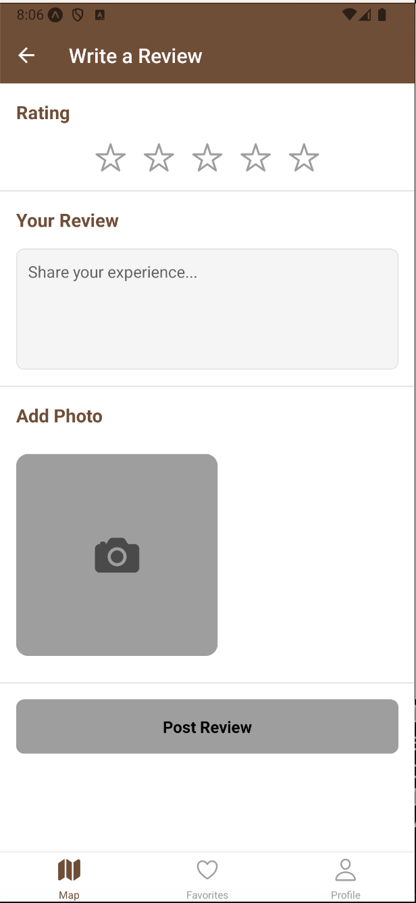

# SipSpotter
## Group 8 Tingyu Li, Mon-Shan Lin

## Overview
This project is a mobile application that enables users to explore cafes, submit reviews, schedule visits, and save favorite cafes. The application is built using React Native and integrates with Firebase for backend services such as authentication and Firestore for data management. The following document provides information about the data model, features, and functionality implemented within the app.

## Features

- User Authentication: Users can register, log in, log out and reset password with email.
- Map: Users can find cafes around them based on their location.
- Yelp API: Users can view ratings, cafe addresses, phone numbers, and hours of operation.
- Reviews: Users can submit, view, edit, and delete reviews for cafes they created. They can view other users' reviews but cannot edit or delete them.
- Sort and Search functionality: reviews are sorted and can be search in cafe detail screen.
- Camera: Users can take multiple pictures using the device camera to add them to their reviews within the app.
- Schedules/Notification: Users can schedule and view visits to cafes. Notifications remind users of their scheduled visits.
- Favorite Cafes: Users can add cafes to their list of favorites and view them on the favorites screen.

## Expo Setup

To ensure optimal performance and compatibility with the latest features, the project has been updated to Expo SDK 52.

## Firebase Setup

Firebase is configured for:

- Authentication: For handling user login, registration, password reset and session management.
- Firestore Database: For storing and managing data related to user profiles, reviews, schedules and favorite cafes.

## Firebase collections:
The app uses three main collections in Firebase Firestore to manage the data: reviews, schedules, and users. Each collection has specific fields and CRUD functionality associated with it.

### 1. Reviews:
This collection holds data related to cafe reviews submitted by app users.

#### CRUD operations:
Create: Users can create new reviews for cafes, which are added to the    collection.  

Read: Users can view existing reviews for a particular cafe, allowing them to see     feedback from other users.

Update: Users can edit their own reviews to modify comments, update the rating, or   add/change photos.

Delete: Users have the option to delete their own reviews, removing their feedback and associated data from the system. 

### 2. Schedules:
This collection records users' scheduled visits to cafes.

#### CRUD operations:
Create: Users can schedule a visit to a cafe, which is saved in the collection, accompanied by a notification setup for reminders.

Read: Users can view their list of scheduled visits, allowing them to see when they have planned visits.

Delete: Users can cancel scheduled visits, removing the associated data from the collection, and any notifications can be canceled accordingly.
 
### 3. Users:
This collection holds data about each user’s profile and their list of favorite cafes.

#### CRUD operations:
Create: Users can add cafes to their list of favorites, which stores the cafe’s details in the user’s favorite list within this collection. Users can also add their user name and profile photo on the profile screen.

Read: Users can view their favorite cafes list, allowing them to see all their saved cafes in one place. In addition, user can view their user profile on the profile screen.

Update: Users can update their profile information, such as their name or profile photo.

Delete: Users can remove cafes from their favorites list.

## Contributions:

### Tingyu Li:
- Initial project setup with basic UI design
- Frontend features creation with unified color patterns and mock samples
- Make necessary frontend adjustments based on backend database feedback
- Debug and fix errors related to pull requests

### Mon-Shan Lin:
- Setup firebase to storing data and user authentication
- Create login and signup screens to allow users to create new accounts or log in to existing ones
- Validate user input (e.g., email format, password strength) 
- Add logout on profile screen
- Create reviews, schedules and users collections
- Implement create, read, update and delete operations for the reviews collection
- Implement create, read and delete operations for the schedules collection
- Implement create, read and delete operations for the users collection
- Implement camera with permission and validation
- Add reset password by entering registered email, receiving a secure reset link via email, and following it to update password.
- Fetch cafe photo from Yelp API.
- Write README file

## Firebase Rules Setup
Ensure your Firestore security rules support data protection and allow access only to authorized users:

```firestore
service cloud.firestore {
  match /databases/{database}/documents {
  
    // Rules for the "reviews" collection
    match /reviews/{reviewId} {
       allow read: if request.auth != null;
       allow create: if request.auth != null;
       allow update, delete: if request.auth != null && request.auth.uid == resource.data.userId;
    }

    // Fallback rule for all other documents
    match /{document=**} {
      allow read, write: if request.auth != null;
    }
  }
}
```
## Firebase Index Setup


## Storage Setup
Ensure your Firestore storage rules match the following: (Please adjust the image size if the current plan usage is not supporting high-resolution images) 

```Storage 
service firebase.storage {
  match /b/{bucket}/o {
    match /reviews/{filename} {
      allow read: if true;  
      allow write: if request.auth != null  
                   && request.resource.size < 5 * 1024 * 1024  
                   && request.resource.contentType.matches('image/.*'); 
    }

    match /{allPaths=**} {
      allow read: if true;
      allow write: if request.auth != null;
    }
  }
}
```

## App Screenshots - Iteration 1

### Login Screen


### Signup Screen


### Favorite Cafe Screen


### Cafe Detail Screen


### Create Review Screen


### Edit Review Screen


### Delete Review Screen


### Create Schedule Screen


### User Profile Screen


## App Screenshots - Iteration 2

### Map Screen 


### Signup Screen 


### Login Screen with Reset Password


### Permission for Notification


### Permission for Camera


### Favorite List


### Search Function


### Cafe Detail with Data Fetch from Yelp


